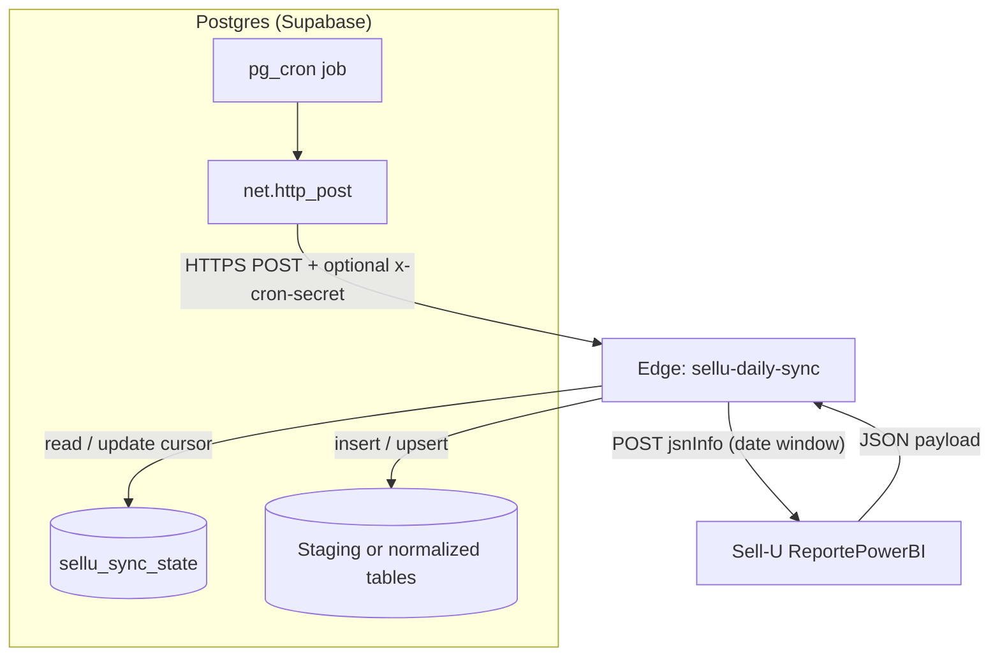

# Architecture

This document describes the **architecture** and **technology stack** of `spike-sellu-crm-supabase-daily-ingest`: a narrow spike that pulls Sell‑U CRM report data into Supabase Postgres on a **daily calendar-day cursor** (through “yesterday” in a configured IANA timezone).

---

## Stack

| Layer | Technology |
|--------|------------|
| **Upstream API** | Sell‑U `ReportePowerBI.php` — `POST` `application/x-www-form-urlencoded` with a `jsnInfo` JSON body (date window + `tipoReporte`: `leads` / `actividades` — literal API values). |
| **Cloud orchestration** | **Supabase**: Postgres (e.g. `raw_*` staging, `sellu_sync_state` cursor), **Edge Functions** (Deno runtime), optional **`pg_cron` + `pg_net`** inside the same Postgres project to invoke the Edge endpoint over HTTPS. |
| **Local parity** | **Node** + `@supabase/supabase-js`; the same ingestion logic lives in `scripts/sellu-sync-engine.mjs` and is run via `scripts/ingest-local.mjs`. **Supabase CLI** + Node script `scripts/deploy-sellu-edge.mjs` push **Edge secrets** (`SELLU_*`, Sell‑U auth, **`INGEST_*`** ingest layout) and **deploy** the function. |
| **Configuration** | Repo `.env` (see `.env.example`). Hosted Edge cannot use **user-defined** secret names prefixed `SUPABASE_*` (CLI restriction); ingest targets are mirrored as **`INGEST_*`** on deploy while local dev may keep `SUPABASE_*`. |

---

## Architecture (layers and flow)

1. **Scheduler (Postgres)** — A `pg_cron` job runs SQL that calls **`net.http_post`** against `https://<project-ref>.supabase.co/functions/v1/sellu-daily-sync`, passing **`x-cron-secret`** when `CRON_SECRET` is set on the Edge function (must match).

2. **Edge (HTTP)** — `index.ts` delegates to **`handler.ts`**: CORS / `OPTIONS`, optional **`CRON_SECRET`** gate, **`createClient(SUPABASE_URL, SUPABASE_SERVICE_ROLE_KEY)`**, then invokes the sync service.

3. **Sync service** — **`sync_service.ts`**: If `SELLU_SYNC_STATE_ENABLED=true`, reads **`sellu_sync_state`** → resolves the **next local calendar day** to sync vs **“yesterday”** in `SELLU_SYNC_TIMEZONE` → **`sellu_api.ts`** POSTs to Sell‑U (with optional legacy GET URLs) → **`payload_parse.ts`** extracts lead/activity-shaped arrays → **`row_mappers.ts`** builds **staging** rows (`import_batch_id`, `aglead`, `raw_payload`, …) or **normalized** upserts (`sellu_id`, FK model).

4. **Persistence** — **Staging**: inserts into configured lead/activity tables, often under schema `raw`, with parent **`import_batches`** rows as required by FKs. **Normalized**: upserts on `sellu_id` / activity dedup keys. After a successful day in state mode, **`last_synced_local_date`** advances so the next run targets the following day.

5. **Security note** — `verify_jwt = false` for this function in `supabase/config.toml`: the Edge route is **not** gated by Supabase JWT. When `CRON_SECRET` is set, **`authorize()`** requires matching `Authorization: Bearer` or **`x-cron-secret`**. If `CRON_SECRET` is unset, anyone who can hit the URL can trigger the sync.

---

## End-to-end pipeline (closed loop)

All of the above forms a **closed pipe**: the database scheduler triggers the Edge function, the function calls Sell‑U and writes back into Postgres, advancing the **daily cursor** until the pipeline is **caught up through “yesterday”** in the configured timezone (the current local calendar day is intentionally not pulled in that design).

**Per run:** at most **one Sell‑U calendar day** is processed in state mode (then the cursor moves forward or returns `caught_up` when the next day would be after “yesterday”). If multiple days are missing, successive cron invocations (or repeated manual invokes) drain the backlog one day at a time.

---

## Repository layout (code map)

| Path | Role |
|------|------|
| `supabase/functions/sellu-daily-sync/` | Edge entrypoint, HTTP handler, sync orchestration, Sell‑U client, payload parsing, row mapping, env/calendar helpers. |
| `scripts/sellu-sync-engine.mjs` | Same sync behaviour as Edge, parameterized by `getEnv`. |
| `scripts/ingest-local.mjs` | Runs the engine locally with `.env`. |
| `scripts/deploy-sellu-edge.mjs` | Maps `SUPABASE_*` ingest vars → `INGEST_*` secrets + `supabase functions deploy`. |
| `supabase/sql/sellu-daily-sync-pg-cron.sql` | Template SQL for scheduling `net.http_post` to the Edge URL. |
| `supabase/migrations/` | Table definitions (`raw`, `public` reference shapes, sync state). |

---

## Related

- [README](../README.md) — deploy steps and cron prerequisites.
- [`.env.example`](../.env.example) — environment variable reference.
